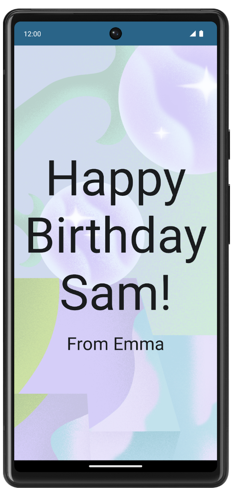
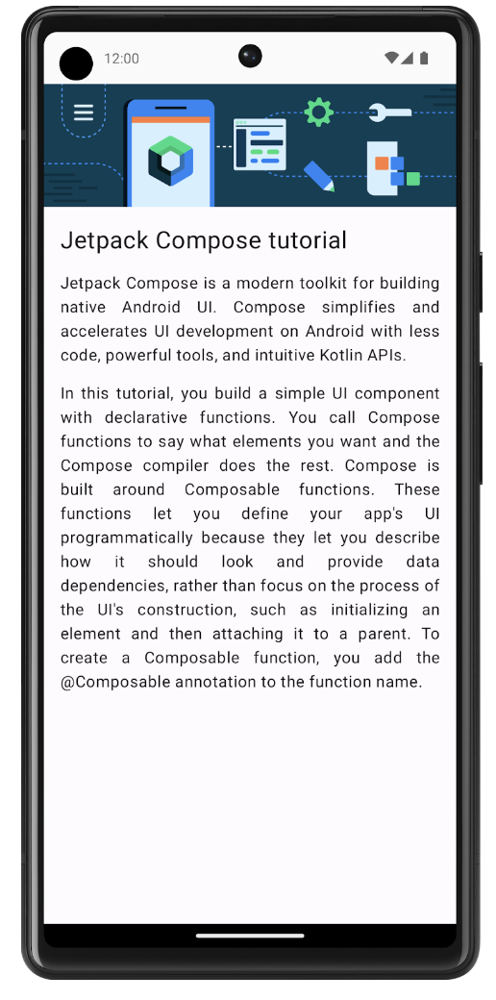
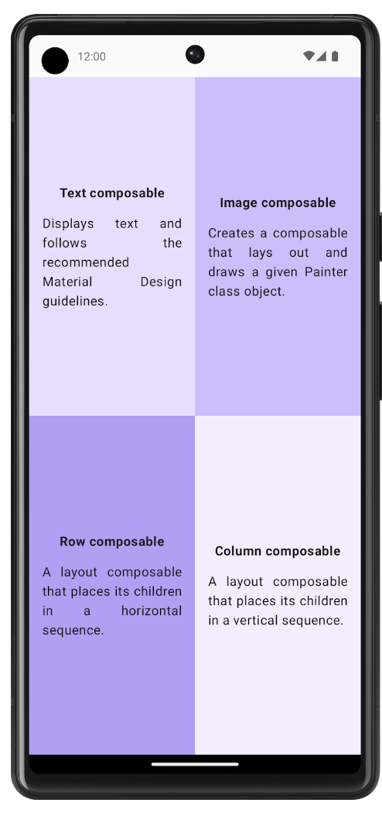
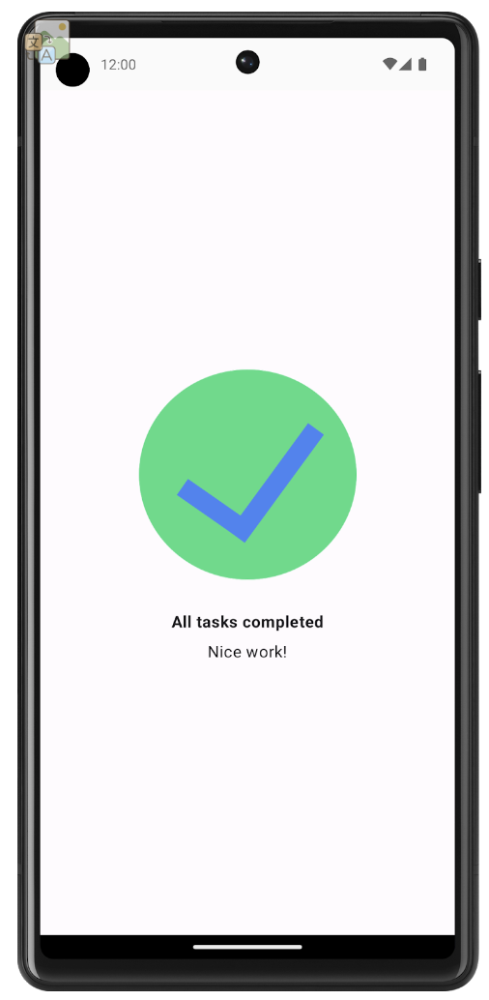
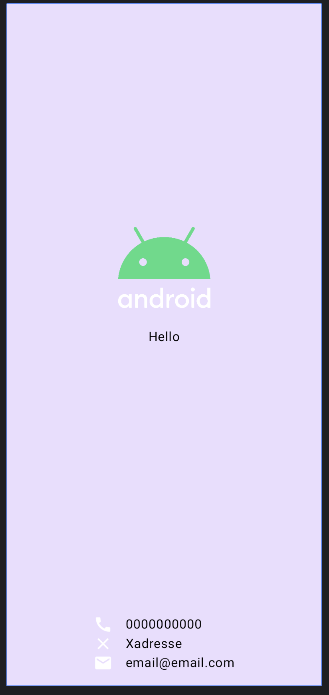

# kotlin

This is my debut on Kotlin, 
I implement some basic UI with Android Studio

## What I learn 
I lean to use jetpack compose, import image, place text, use column and row. 
Styling text, spacing. and color.

